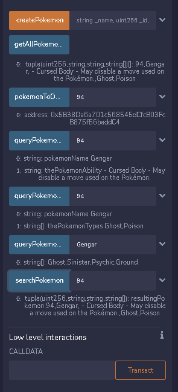

# **Ethereum program developer**

 

## **Solución reto 4 - Creando tu primer Smart Contract**

---

 

- ### **Actividad 1:** Investigar que son los Events en Solidity.

 

Los Events(eventos) en Solidity son un conjunto de abstracciones que permiten obtener y proporcionar información de un contrato inteligente.

Estos eventos se dividen en dos categorías: Los indexados y los no indexados.

Uno de los casos de uso de los eventos, es poder comunicarle información a nuestros usuarios mediante una interfaz.

Más sobre los eventos en: [Solidity docs](https://docs.soliditylang.org/en/v0.8.15/abi-spec.html?highlight=Events#events)

 

- ### **Actividad 2:** Investigar sobre “”require” en Solidity.

 

Require es un elemento del conjunto de Control structures(estructuras de control) en Solidity. La tarea de un require es verificar si se cumple una o varias condiciones dentro de la función o punto de nuestro smart contract donde lo invoquemos. 

De no cumplir todas las condiciones, detiene la ejecución de la transacción o función y envia un mensaje personalizado por nosotros al usuario.

Más sobre los eventos en: [Solidity docs](https://docs.soliditylang.org/en/v0.8.15/control-structures.html?highlight=Require#error-handling-assert-require-revert-and-exceptions)

 

- ### **Actividad 3:** Código del smart contract.

 

[**Smart contract** - Pokemon Factory](./PokemonFactory.sol)

 

**Características resaltantes:**

 

- Función para consultar habilidad del pokemon.

- Función para consultar el tipo o tipos del pokemon.

- Función para consultar las debilidades del pokemon.

- Función para buscar un pokemon en específico una vez creado.

- Require para validar si existe algún pokemon en el array "pokemons" antes de poder usar alguna de las anteriores funciones.

 

---

 

**Referencia a tipos de pokemones y sus debilidades:**

 

- **Bug:** Fire, Flying, Rock

- **Dragon:** Dragon, Fairy, Ice

- **Electric:** Ground, Rock

- **Fairy:** Poison, Steel

- **Fighting:** Fairy, Flying, Psychic

- **Fire:** Ground, Rock, Water

- **Flying:** Ice, Electric, Rock

- **Ghost:** Ghost, Sinister

- **Ground:** Ice, Plant, Water

- **Ice:** Fighting, Fire, Rock, Steel

- **Normal:** Fighting

- **Plant:** Bug, Fire, Flying, Ice, Poison 

- **Poison:** Ground, Psychic

- **Psychic:** Bug, Ghost, Rock, Sinister

- **Rock:** Ground, Fighting, Plant, Steel, Water

- **Sinister:** Bug, Fighting, Ground

- **Steel:** Fighting, Fire, Ground

- **Water:** Electric, Plant

 

### **Como crear un nuevo pokemon**

---

 

---

 

### **Como usar las funciones del contrato**

 

---
